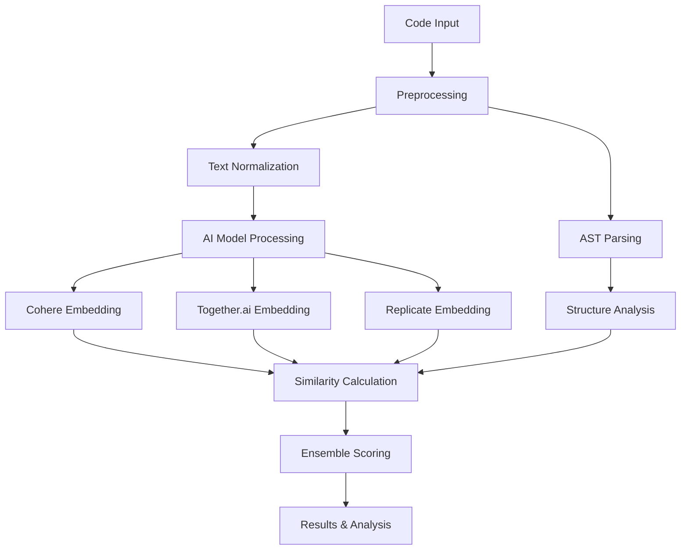

# AI Code Plagiarism Detector 🚀

<div align="center">


**🎯 Smart. Fair. Original.**

*A comprehensive full-stack web application for detecting code plagiarism using multiple AI models and providing detailed code analysis.*

[🚀 Live Demo](https://code-plagiarism-detector.vercel.app/) | [📚 Documentation](#-usage-guide) | [🛠️ Installation](#-installation) | [🤝 Contributing](#-contributing)

</div>

---

## 📖 Table of Contents

- [Overview](#-overview)
- [Features](#-features)
- [Technology Stack](#-technology-stack)
- [Installation](#-installation)
- [Usage Guide](#-usage-guide)
- [API Documentation](#-api-documentation)
- [Project Structure](#-project-structure)
- [AI Models & Analysis](#-ai-models--analysis)
- [Future Work](#-future-work)
- [Contributing](#-contributing)
- [License](#-license)
- [Author](#-author)

---

## 🌟 Overview

The **AI Code Plagiarism Detector** is an advanced full-stack application that leverages multiple AI models to detect code similarities and potential plagiarism. Built with modern web technologies, it provides comprehensive code analysis including semantic similarity detection, structural analysis, complexity metrics, and AI-generated code identification.

### 🎯 Purpose

In academic and professional environments, ensuring code originality is crucial. This tool helps:
- **Educators**: Detect student code plagiarism with high accuracy
- **Developers**: Ensure code originality in projects
- **Organizations**: Maintain code integrity and compliance
- **Researchers**: Analyze code similarity patterns

### 🧠 How It Works

The application uses a multi-model approach combining:
1. **Cohere's Embed Models** for semantic understanding
2. **Together.ai's BGE Models** for code-specific patterns
3. **Replicate's Universal Encoders** for cross-validation
4. **Custom AST Analysis** for structural comparison
5. **Ensemble Scoring** for accurate results

---

## ✨ Features

### 🔍 **Multi-Model Plagiarism Detection**
- **Triple AI Analysis**: Combines Cohere, Together.ai, and Replicate for comprehensive detection
- **Semantic Understanding**: Analyzes code meaning beyond syntax matching
- **Ensemble Scoring**: Aggregates results from multiple models for accuracy
- **Real-time Processing**: Instant analysis with detailed similarity percentages

### 📊 **Comprehensive Code Analysis**
- **Structural Analysis**: Examines code organization, functions, classes, and architecture
- **Complexity Metrics**: Calculates cyclomatic complexity for maintainability assessment
- **Style Evaluation**: Analyzes coding patterns, naming conventions, and best practices
- **AI Detection**: Identifies potentially AI-generated code with confidence scores

### 🔬 **Advanced Comparison Modes**

#### Standard Comparison
- Side-by-side code analysis
- Combined similarity scoring
- Visual similarity indicators
- Quick plagiarism assessment

#### Detailed Analysis
- Individual code snippet analysis
- Comprehensive metrics for each code
- Structural similarity breakdown
- Plagiarism pattern identification

#### Single Code Analysis
- Standalone code evaluation
- Quality metrics assessment
- Complexity analysis
- AI generation detection

### 🎨 **Modern User Experience**
- **Responsive Design**: Works seamlessly across all devices
- **Dark/Light Themes**: Beautiful theme switching with system preference detection
- **Monaco Editor**: Professional VS Code-style editor with syntax highlighting
- **Smooth Animations**: Framer Motion-powered interactions
- **Interactive Visualizations**: Chart.js-powered similarity score displays
- **Real-time Feedback**: Instant analysis updates and loading states

---

## 🛠️ Technology Stack

### Backend Architecture
```
Flask Application
├── 🐍 Python 3.8+
├── 🌐 Flask (Web Framework)
├── 🧠 Cohere API (Semantic Embeddings)
├── 🚀 Together.ai API (Code Embeddings)
├── 🔄 Replicate API (ML Inference)
├── 📊 scikit-learn (Similarity Calculations)
├── 🌳 Python AST (Code Structure Analysis)
└── 🔧 CORS Support (Cross-Origin Requests)
```

### Frontend Architecture
```
Next.js Application
├── ⚛️ React 18+ (UI Library)
├── 🚀 Next.js 14 (Framework)
├── 🎨 TailwindCSS (Styling)
├── 🎭 Framer Motion (Animations)
├── 💻 Monaco Editor (Code Editor)
├── 📊 Chart.js (Data Visualization)
├── 🌙 Theme System (Dark/Light Mode)
└── 📱 Responsive Design
```

---

## 🚀 Installation

### Prerequisites
- **Python 3.8+** with pip
- **Node.js 16+** with npm/yarn
- **Git** for cloning
- **API Keys** for AI services

### 1. Clone the Repository
```bash
git clone https://github.com/Erebuzzz/Code-Plagiarism-Detector.git
cd Code-Plagiarism-Detector
```

### 2. Backend Setup
```bash
# Create virtual environment (recommended)
python -m venv venv
source venv/bin/activate  # On Windows: venv\Scripts\activate

# Install Python dependencies
pip install -r requirements.txt

# Set up environment variables
cp .env.example .env
```

### 3. Frontend Setup
```bash
# Navigate to frontend directory
cd frontend

# Install Node.js dependencies
npm install
# or
yarn install
```

### 4. Environment Configuration

Edit `.env` file with your API keys:
```env
# AI Service API Keys
COHERE_API_KEY=your_cohere_api_key_here
TOGETHER_API_KEY=your_together_api_key_here
REPLICATE_API_TOKEN=your_replicate_token_here

# Application Configuration
FLASK_ENV=development
FLASK_DEBUG=True
```

#### 🔑 Getting API Keys

1. **Cohere API**: 
   - Visit [Cohere Dashboard](https://dashboard.cohere.ai/)
   - Sign up and get your API key
   - Free tier available

2. **Together.ai API**:
   - Visit [Together.ai](https://together.ai/)
   - Create account and generate API key
   - Credits-based pricing

3. **Replicate API**:
   - Visit [Replicate](https://replicate.com/)
   - Sign up and get API token
   - Pay-per-use model

### 5. Run the Application

#### Development Mode
```bash
# Terminal 1: Start Flask backend
python main.py
# Backend runs on http://localhost:5000

# Terminal 2: Start Next.js frontend
cd frontend
npm run dev
# Frontend runs on http://localhost:3000
```

#### Production Mode
```bash
# Build frontend
cd frontend
npm run build
npm start

# Run backend in production
python main.py
```

Visit `http://localhost:3000` to access the application!

---

## 📚 Usage Guide

### 🏠 **Home Page - Code Comparison**

The main feature for comparing two code snippets:

1. **Input Code**:
   - Paste or type code in the left editor (Code 1)
   - Paste or type code in the right editor (Code 2)
   - Support for multiple programming languages

2. **Analysis**:
   - Click **"Compare Code"** button
   - Wait for AI processing (usually 2-5 seconds)
   - View comprehensive results

3. **Results Interpretation**:
   ```
   🟢 0-40%   → Different implementations, likely original
   🔵 40-60%  → Some similarities, possibly coincidental
   🟡 60-80%  → Significant similarities, review recommended
   🔴 80-100% → High similarity, potential plagiarism detected
   ```

### 📊 **Code Analysis Page**

Analyze a single code snippet for quality and characteristics:

1. **Single Code Input**:
   - Paste your code in the editor
   - Select programming language (auto-detected)
   - Click **"Analyze Code"**

2. **Analysis Results**:
   - **Structure Analysis**: Functions, classes, imports
   - **Complexity Metrics**: Cyclomatic complexity score
   - **Style Assessment**: Coding patterns and conventions
   - **AI Detection**: Probability of AI-generated code

3. **Complexity Levels**:
   ```
   🟢 1-5    → Simple, highly maintainable
   🔵 6-10   → Moderate complexity, acceptable
   🟡 11-15  → High complexity, consider refactoring
   🔴 16+    → Very high complexity, refactoring needed
   ```

### 🔬 **Detailed Comparison Page**

Advanced side-by-side analysis with comprehensive metrics:

1. **Enhanced Comparison**:
   - Input two code snippets
   - Get individual analysis for each code
   - Compare structural similarities
   - Identify specific plagiarism patterns

2. **Detailed Metrics**:
   - **Individual Scores**: Separate analysis for each snippet
   - **Structural Comparison**: Function/class similarity
   - **Style Matching**: Coding pattern similarities
   - **Plagiarism Indicators**: Specific flags and explanations

### 🎨 **UI Features**

- **Theme Toggle**: Switch between dark and light modes
- **Code Editor**: Full-featured Monaco editor with:
  - Syntax highlighting
  - Auto-completion
  - Error detection
  - Line numbers
  - Code folding
- **Responsive Design**: Works on desktop, tablet, and mobile
- **Loading States**: Visual feedback during analysis
- **Error Handling**: User-friendly error messages

---

## 🔌 API Documentation

### Base URL
```
Local Development: http://localhost:5000
Production: Your deployed backend URL
```

### Authentication
Currently, no authentication is required. Future versions will include API key authentication.

### Endpoints

#### 1. Code Similarity Check
```http
POST /check
Content-Type: application/json

{
  "code1": "def hello():\n    print('Hello World')",
  "code2": "def greet():\n    print('Hello World')"
}
```

**Response:**
```json
{
  "cohere_similarity": 0.85,
  "together_similarity": 0.82,
  "replicate_similarity": 0.87,
  "average_similarity": 0.85,
  "similarity_percentage": 85.0,
  "analysis": "High similarity detected between code snippets...",
  "processing_time": 2.34
}
```

#### 2. Single Code Analysis
```http
POST /analyze
Content-Type: application/json

{
  "code": "def fibonacci(n):\n    if n <= 1:\n        return n\n    return fibonacci(n-1) + fibonacci(n-2)"
}
```

**Response:**
```json
{
  "structure_analysis": {
    "functions": 1,
    "classes": 0,
    "imports": 0,
    "comments": 0
  },
  "complexity_analysis": {
    "cyclomatic_complexity": 3,
    "complexity_level": "Low"
  },
  "style_analysis": {
    "naming_convention": "snake_case",
    "docstring_coverage": 0,
    "style_score": 7
  },
  "ai_detection": {
    "ai_probability": 0.15,
    "confidence": "Low",
    "indicators": []
  }
}
```

#### 3. Detailed Comparison
```http
POST /detailed-check
Content-Type: application/json

{
  "code1": "first code snippet",
  "code2": "second code snippet"
}
```

**Response:**
```json
{
  "similarity_analysis": {
    "overall_similarity": 0.75,
    "structural_similarity": 0.80,
    "semantic_similarity": 0.70
  },
  "code1_analysis": { /* Individual analysis */ },
  "code2_analysis": { /* Individual analysis */ },
  "comparison_details": {
    "similar_functions": ["function1", "function2"],
    "similar_patterns": ["pattern1", "pattern2"],
    "plagiarism_indicators": []
  }
}
```

### Error Responses
```json
{
  "error": "Error message",
  "code": 400,
  "details": "Additional error information"
}
```

---

## 📁 Project Structure

```
Code-Plagiarism-Detector/
├── 📄 main.py                 # Flask backend application
├── 📄 requirements.txt        # Python dependencies
├── 📄 .env                   # Environment variables (create from .env.example)
├── 📄 .env.example           # Environment template
├── 📄 README.md              # Project documentation
├── 📄 LICENSE                # MIT License
├── 📄 .gitignore            # Git ignore rules
│
├── 📁 frontend/              # Next.js frontend application
│   ├── 📁 pages/            # Next.js pages
│   │   ├── 📄 index.js      # Home page (main comparison)
│   │   ├── 📄 analysis.js   # Single code analysis page
│   │   ├── 📄 comparison.js # Detailed comparison page
│   │   └── 📄 _app.js       # App configuration
│   │
│   ├── 📁 components/       # Reusable React components
│   │   ├── 📄 CodeEditor.js        # Monaco code editor wrapper
│   │   ├── 📄 ResultsPanel.js      # Analysis results display
│   │   ├── 📄 CodeAnalysisPage.js  # Single analysis component
│   │   ├── 📄 ThemeToggle.js       # Dark/light mode toggle
│   │   ├── 📄 Layout.js            # Main layout component
│   │   └── 📄 LoadingSpinner.js    # Loading animation
│   │
│   ├── 📁 styles/           # CSS and styling
│   │   ├── 📄 globals.css   # Global styles
│   │   └── 📄 components.css # Component-specific styles
│   │
│   ├── 📁 utils/            # Utility functions
│   │   ├── 📄 api.js        # API communication helpers
│   │   └── 📄 theme.js      # Theme management
│   │
│   ├── 📄 package.json      # Frontend dependencies
│   ├── 📄 tailwind.config.js # TailwindCSS configuration
│   └── 📄 next.config.js    # Next.js configuration
│
├── 📁 backend/              # Backend utilities (optional organization)
│   ├── 📄 ai_models.py     # AI model integration
│   ├── 📄 code_analyzer.py # Code analysis functions
│   └── 📄 utils.py         # Helper functions
│
└── 📁 docs/                # Additional documentation
    ├── 📄 DEPLOYMENT.md    # Deployment guide
    ├── 📄 API.md          # Detailed API documentation
    └── 📄 CONTRIBUTING.md  # Contribution guidelines
```

---

## 🧠 AI Models & Analysis

### Model Architecture

#### 1. **Cohere Embed API**
- **Model**: `embed-english-v3.0`
- **Strengths**: 
  - Advanced semantic understanding
  - Natural language processing in comments
  - Context-aware embeddings
- **Use Case**: Analyzing code logic and semantic meaning

#### 2. **Together.ai BGE Model**
- **Model**: `BAAI/bge-base-en-v1.5`
- **Strengths**:
  - Code-specialized embeddings
  - Technical pattern recognition
  - Programming language understanding
- **Use Case**: Code-specific similarity detection

#### 3. **Replicate Universal Encoder**
- **Model**: Various universal sentence encoders
- **Strengths**:
  - General-purpose similarity
  - Cross-validation capabilities
  - Robust pattern matching
- **Use Case**: Ensemble validation and scoring

### Analysis Pipeline



### Similarity Calculation

The application uses multiple similarity metrics:

1. **Cosine Similarity**: Primary metric for embedding comparison
2. **Structural Similarity**: AST-based code structure comparison
3. **Token Similarity**: Normalized token-level comparison
4. **Semantic Similarity**: Meaning-based comparison using embeddings

### AI Detection Algorithm

The AI-generated code detection uses pattern recognition:

```python
def detect_ai_generated(code):
    indicators = {
        'generic_naming': check_generic_names(code),
        'perfect_formatting': check_formatting_patterns(code),
        'common_ai_patterns': check_ai_signatures(code),
        'comment_style': analyze_comment_patterns(code),
        'complexity_uniformity': check_complexity_patterns(code)
    }
    
    confidence = calculate_ai_probability(indicators)
    return confidence, indicators
```

---

## 🚀 Future Work

### 🎯 Short-term Enhancements (Next 3 months)

#### 🔐 **Authentication & User Management**
- User registration and login system
- Personal dashboards for analysis history
- API key management for rate limiting
- Role-based access control (student, teacher, admin)

#### 📊 **Enhanced Analytics**
- Historical analysis tracking
- Plagiarism trend analysis
- Batch processing for multiple files
- Export results to PDF/CSV formats

#### 🌐 **Language Support Expansion**
- Support for 20+ programming languages
- Language-specific analysis rules
- Multi-language code comparison
- Syntax highlighting improvements

### 🎯 Medium-term Goals (3-6 months)

#### 🤖 **Advanced AI Integration**
- Custom fine-tuned models for code similarity
- Integration with GPT-4 for detailed explanations
- Automated code review suggestions
- Plagiarism pattern learning system

#### 🏫 **Educational Features**
- Classroom management system
- Assignment submission and analysis
- Plagiarism report generation
- Student progress tracking

#### 🔧 **Performance Optimization**
- Caching layer for repeated analyses
- Asynchronous processing for large files
- CDN integration for faster loading
- Database optimization

### 🎯 Long-term Vision (6+ months)

#### 🌍 **Enterprise Solutions**
- Multi-tenant architecture
- Enterprise SSO integration
- Advanced reporting and analytics
- Custom deployment options

#### 🔬 **Research Features**
- Academic paper integration
- Citation analysis
- Code evolution tracking
- Plagiarism network analysis

#### 🚀 **Advanced Technology Integration**
- Blockchain-based verification
- Real-time collaboration features
- Mobile application development
- Voice-to-code analysis

#### 🎨 **User Experience Enhancements**
- AI-powered code suggestions
- Interactive plagiarism explanations
- Customizable analysis parameters
- Advanced visualization tools

### 🛠️ **Technical Improvements**

#### 🏗️ **Architecture Enhancements**
- Microservices architecture
- Kubernetes deployment
- Advanced monitoring and logging
- Auto-scaling capabilities

#### 🔒 **Security Features**
- End-to-end encryption
- Secure code storage
- Privacy compliance (GDPR, CCPA)
- Advanced threat detection

#### 📱 **Platform Expansion**
- Mobile app (React Native)
- Desktop application (Electron)
- IDE plugins (VS Code, IntelliJ)
- Command-line interface

### 💡 **Innovation Ideas**

#### 🎓 **Educational AI**
- Personalized learning recommendations
- Code quality improvement suggestions
- Automated tutoring system
- Skill assessment tools

#### 🔍 **Advanced Detection**
- Cross-platform plagiarism detection
- Real-time collaboration monitoring
- Code evolution analysis
- Automated code review

---

## 🤝 Contributing

We welcome contributions from the community! Here's how you can help:

### 🐛 **Bug Reports**
- Use the issue tracker to report bugs
- Include detailed reproduction steps
- Provide system information and logs
- Add screenshots if applicable

### 💡 **Feature Requests**
- Suggest new features through issues
- Provide use case scenarios
- Include mockups or designs if possible
- Discuss implementation approaches

### 🔧 **Code Contributions**

#### Setup Development Environment
```bash
# Fork the repository
git clone https://github.com/your-username/Code-Plagiarism-Detector.git

# Create a feature branch
git checkout -b feature/your-feature-name

# Make your changes
# Test thoroughly
# Commit with clear messages

# Push and create pull request
git push origin feature/your-feature-name
```

#### Contribution Guidelines
- Follow existing code style and conventions
- Add tests for new features
- Update documentation as needed
- Ensure all tests pass before submitting
- Write clear commit messages

### 📝 **Documentation**
- Improve existing documentation
- Add examples and use cases
- Create tutorials and guides
- Translate documentation

### 🎨 **Design Contributions**
- UI/UX improvements
- Icon and graphic design
- Mobile responsiveness
- Accessibility enhancements

---

## 📄 License

This project is licensed under the **MIT License** - see the [LICENSE](LICENSE) file for details.

```
MIT License

Copyright (c) 2024 Erebus (Kshitiz Kumar Sinha)

Permission is hereby granted, free of charge, to any person obtaining a copy
of this software and associated documentation files (the "Software"), to deal
in the Software without restriction, including without limitation the rights
to use, copy, modify, merge, publish, distribute, sublicense, and/or sell
copies of the Software, and to permit persons to whom the Software is
furnished to do so, subject to the following conditions:

The above copyright notice and this permission notice shall be included in all
copies or substantial portions of the Software.
```

---

## 👨‍💻 Author

<div align="center">

### **Erebus (Kshitiz Kumar Sinha)**

*Full-Stack Developer & AI Enthusiast*

[](https://github.com/Erebuzzz)
[](https://www.linkedin.com/in/kksinha23)
[](mailto:kshitiz23kumar@gmail.com)

---

*"Building intelligent solutions to make code analysis smarter and fairer."*

</div>

### 🎯 **About the Developer**

Erebus is a passionate full-stack developer specializing in AI-powered applications and modern web technologies. With expertise in Python, JavaScript, and machine learning, he creates innovative solutions that bridge the gap between complex AI capabilities and user-friendly interfaces.

### 🛠️ **Technical Expertise**
- **Backend**: Python, Flask, Node.js, API Integration
- **Frontend**: React, Next.js, TailwindCSS, Modern UI/UX
- **AI/ML**: LLM Integration, Embedding Models, Similarity Analysis
- **DevOps**: Cloud Deployment, CI/CD, Performance Optimization

---

## 🙏 Acknowledgments

Special thanks to:

- **[Cohere](https://cohere.ai/)** for providing advanced embedding models
- **[Together.ai](https://together.ai/)** for code-specialized AI models
- **[Replicate](https://replicate.com/)** for machine learning infrastructure
- **[Vercel](https://vercel.com/)** for frontend deployment platform
- **[Next.js Team](https://nextjs.org/)** for the amazing React framework
- **[TailwindCSS](https://tailwindcss.com/)** for beautiful utility-first styling
- **Open Source Community** for inspiration and support

---

## 📞 Support & Contact

### 🆘 **Getting Help**
- 📧 **Email**: [kshitiz23kumar@gmail.com](mailto:kshitiz23kumar@gmail.com)
- 🐛 **Issues**: [GitHub Issues](https://github.com/Erebuzzz/Code-Plagiarism-Detector/issues)
- 💬 **Discussions**: [GitHub Discussions](https://github.com/Erebuzzz/Code-Plagiarism-Detector/discussions)

### 🤝 **Professional Inquiries**
- 💼 **LinkedIn**: [linkedin.com/in/kksinha23](https://www.linkedin.com/in/kksinha23)
- 🌐 **Portfolio**: [GitHub Profile](https://github.com/Erebuzzz)

---

<div align="center">

**⭐ If you find this project useful, please consider giving it a star! ⭐**

</div>
